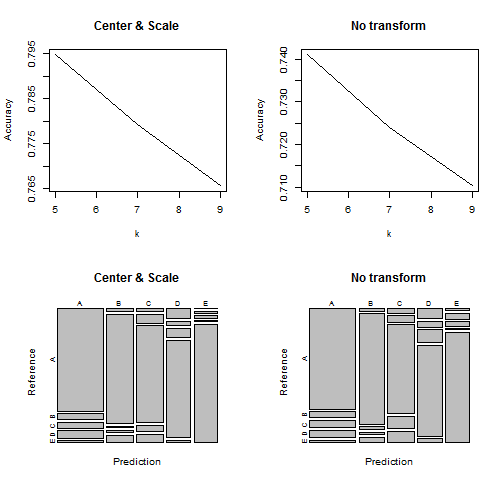
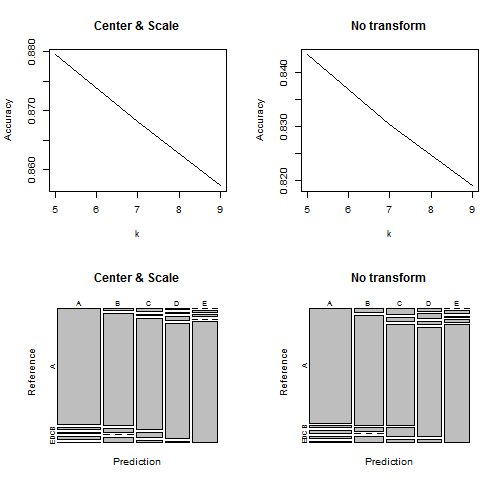
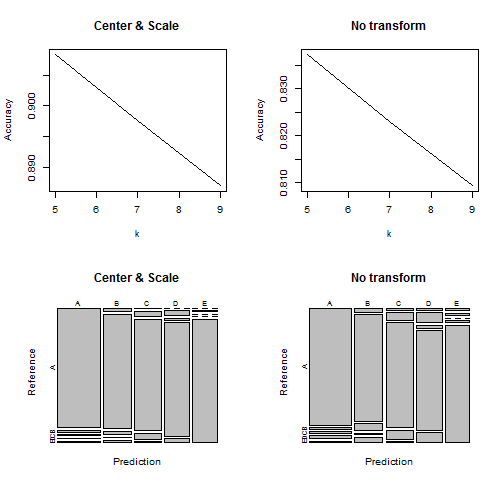

```r
# Loading libraries
library(ggplot2)
library(caret)
```

```
## Loading required package: lattice
```

```r

# Set random seed
set.seed(123)

# Set working directory
setwd("E:\\Coursera\\pml\\R")
```

# Predicting 'classe' Value

## Analyzing Data

Loading the data:


```r
# Read work data
data <- read.csv("pml-training.csv")
predict <- read.csv("pml-testing.csv")
```


Since we are talking about the prediction based on the sensor(s) output and fixed number of output
results (classe), we can state that output of the sensor is a number, and such number must be defined for every measurement.

With a simple analysys we can list columns in an input dataset which are 100% numeric. Here they are:

"roll_belt",
"pitch_belt",
"yaw_belt",
"total_accel_belt",
"gyros_belt_x",
"gyros_belt_y",
"gyros_belt_z",
"accel_belt_x",
"accel_belt_y",
"accel_belt_z",
"magnet_belt_x",
"magnet_belt_y",
"magnet_belt_z",
"roll_arm",
"pitch_arm",
"yaw_arm",
"total_accel_arm",
"gyros_arm_x",
"gyros_arm_y",
"gyros_arm_z",
"accel_arm_x",
"accel_arm_y",
"accel_arm_z",
"magnet_arm_x",
"magnet_arm_y",
"magnet_arm_z",
"roll_dumbbell",
"pitch_dumbbell",
"yaw_dumbbell",
"total_accel_dumbbell",
"gyros_dumbbell_x",
"gyros_dumbbell_y",
"gyros_dumbbell_z",
"accel_dumbbell_x",
"accel_dumbbell_y",
"accel_dumbbell_z",
"magnet_dumbbell_x",
"magnet_dumbbell_y",
"magnet_dumbbell_z",
"roll_forearm",
"pitch_forearm",
"yaw_forearm",
"total_accel_forearm",
"gyros_forearm_x",
"gyros_forearm_y",
"gyros_forearm_z",
"accel_forearm_x",
"accel_forearm_y",
"accel_forearm_z",
"magnet_forearm_x",
"magnet_forearm_y",
"magnet_forearm_z"

## Pick up the approach

Let's focus on columns ended with x, y, or z. Here we can find following classes of the sensors: accel, gyros and marnet. Mixing those values is not a good idea, so let's analyze those measurements one by one.

To build a model it is quite suitable using the K-Nearest Neighbor approach, which is quite fast and working well with vectors.

## Creating train and test data sets

Since final test dataset is quite small it was decided to split the data 95% vs 5% proportion (train vs test)


```r
# Create training and testing datasets
index <- createDataPartition(y = data$classe, p = 0.95, list = FALSE)
train <- data[index, ]
test <- data[-index, ]
```


## Gyros data analyzing


```r
fit0 <- train(classe ~ gyros_belt_x + gyros_belt_y + gyros_belt_z + gyros_arm_x + 
    gyros_arm_y + gyros_arm_z + gyros_dumbbell_x + gyros_dumbbell_y + gyros_dumbbell_z + 
    gyros_forearm_x + gyros_forearm_y + gyros_forearm_z, data = train, method = "knn", 
    preProcess = c("center", "scale"))

fit1 <- train(classe ~ gyros_belt_x + gyros_belt_y + gyros_belt_z + gyros_arm_x + 
    gyros_arm_y + gyros_arm_z + gyros_dumbbell_x + gyros_dumbbell_y + gyros_dumbbell_z + 
    gyros_forearm_x + gyros_forearm_y + gyros_forearm_z, data = train, method = "knn")

# Charting
par(mfrow = c(2, 2))
plot(fit0$results$k, fit0$results$Accuracy, type = "l", xlab = "k", ylab = "Accuracy", 
    main = "Center & Scale")
plot(fit1$results$k, fit1$results$Accuracy, type = "l", xlab = "k", ylab = "Accuracy", 
    main = "No transform")
# Test with test data
r0 <- predict(fit0, newdata = test)
cm0 <- confusionMatrix(r0, test$classe)
r1 <- predict(fit1, newdata = test)
cm1 <- confusionMatrix(r1, test$classe)
plot(cm0$table, main = "Center & Scale")
plot(cm1$table, main = "No transform")
```

 


## Accelerometer data analyzing


```r
fit0 <- train(classe ~ accel_belt_x + accel_belt_y + accel_belt_z + accel_arm_x + 
    accel_arm_y + accel_arm_z + accel_dumbbell_x + accel_dumbbell_y + accel_dumbbell_z + 
    accel_forearm_x + accel_forearm_y + accel_forearm_z, data = train, method = "knn", 
    preProcess = c("center", "scale"))

fit1 <- train(classe ~ accel_belt_x + accel_belt_y + accel_belt_z + accel_arm_x + 
    accel_arm_y + accel_arm_z + accel_dumbbell_x + accel_dumbbell_y + accel_dumbbell_z + 
    accel_forearm_x + accel_forearm_y + accel_forearm_z, data = train, method = "knn")

# Charting
par(mfrow = c(2, 2))
plot(fit0$results$k, fit0$results$Accuracy, type = "l", xlab = "k", ylab = "Accuracy", 
    main = "Center & Scale")
plot(fit1$results$k, fit1$results$Accuracy, type = "l", xlab = "k", ylab = "Accuracy", 
    main = "No transform")
# Test with test data
r0 <- predict(fit0, newdata = test)
cm0 <- confusionMatrix(r0, test$classe)
r1 <- predict(fit1, newdata = test)
cm1 <- confusionMatrix(r1, test$classe)
plot(cm0$table, main = "Center & Scale")
plot(cm1$table, main = "No transform")
```

 


## Magnet sensor data analyzing


```r
fit0 <- train(classe ~ magnet_belt_x + magnet_belt_y + magnet_belt_z + magnet_arm_x + 
    magnet_arm_y + magnet_arm_z + magnet_dumbbell_x + magnet_dumbbell_y + magnet_dumbbell_z + 
    magnet_forearm_x + magnet_forearm_y + magnet_forearm_z, data = train, method = "knn", 
    preProcess = c("center", "scale"))

fit1 <- train(classe ~ magnet_belt_x + magnet_belt_y + magnet_belt_z + magnet_arm_x + 
    magnet_arm_y + magnet_arm_z + magnet_dumbbell_x + magnet_dumbbell_y + magnet_dumbbell_z + 
    magnet_forearm_x + magnet_forearm_y + magnet_forearm_z, data = train, method = "knn")

# Charting
par(mfrow = c(2, 2))
plot(fit0$results$k, fit0$results$Accuracy, type = "l", xlab = "k", ylab = "Accuracy", 
    main = "Center & Scale")
plot(fit1$results$k, fit1$results$Accuracy, type = "l", xlab = "k", ylab = "Accuracy", 
    main = "No transform")
# Test with test data
r0 <- predict(fit0, newdata = test)
cm0 <- confusionMatrix(r0, test$classe)
r1 <- predict(fit1, newdata = test)
cm1 <- confusionMatrix(r1, test$classe)
plot(cm0$table, main = "Center & Scale")
plot(cm1$table, main = "No transform")
```

 


## Final predictions

After analyzing of the results from a different groups magnet sensor data with transformation (senter and scale) were selected for a final prediction.


```r
fit <- train(classe ~ magnet_belt_x + magnet_belt_y + magnet_belt_z + magnet_arm_x + 
    magnet_arm_y + magnet_arm_z + magnet_dumbbell_x + magnet_dumbbell_y + magnet_dumbbell_z + 
    magnet_forearm_x + magnet_forearm_y + magnet_forearm_z, data = data, method = "knn", 
    preProcess = c("center", "scale"))
r <- predict(fit, newdata = predict)
predict[, "classe"] <- r
result <- predict[, c("problem_id", "classe")]
```


So here is the results:


```r
result
```

```
##    problem_id classe
## 1           1      B
## 2           2      A
## 3           3      B
## 4           4      A
## 5           5      A
## 6           6      E
## 7           7      D
## 8           8      B
## 9           9      A
## 10         10      A
## 11         11      D
## 12         12      C
## 13         13      B
## 14         14      A
## 15         15      E
## 16         16      E
## 17         17      A
## 18         18      B
## 19         19      B
## 20         20      B
```


Saving the files with results:


```r
n = nrow(result)
for (i in 1:n) {
    filename = paste0("problem_id_", result[i, "problem_id"], ".txt")
    write.table(result[i, "classe"], file = filename, quote = FALSE, row.names = FALSE, 
        col.names = FALSE)
}
```

